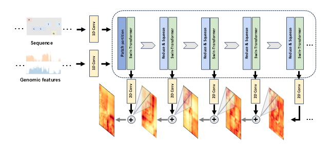

# HiCGen
a hierarchical and cell-type-specific genome organization generator 

HiCGen is a deep learning framework for predicting multiscale 3D genome organization (1 kb to 128 kb resolution) using DNA sequences and genomic features. Built on Swin-Transformer, HiCGen enables cross-cell-type predictions and *in silico* perturbation analysis to study structural consequences of genetic/epigenetic changes. 

**Paper**: [BioRxiv Preprint](https://www.biorxiv.org/) | **Demo Data**: [Data link](docs/)



## Key Features
- **Multiscale Prediction**: Generate hierarchical contact maps (1 kb to 128 kb resolutions) from sequence and epigenetic signals.
- **Cross-Cell Generalization**: Predict chromatin architecture for unseen cell types using cell-specific ATAC-seq/ChIP-seq profiles.
- **Perturbation Analysis**: Simulate structural changes caused by enhancer/promoter activation/silencing or CTCF boundary editing.

## Installation

### Dependencies
- Python 3.9+
- PyTorch 2.0+
- CUDA 11.7+ (GPU recommended)
- PyTorch Lightning
- [cooler](https://github.com/open2c/cooler), [cootools](https://github.com/open2c/cooltools)
- [kipoiseq](https://github.com/kipoi/kipoiseq),[pyBigWig](https://github.com/deeptools/pyBigWig)

### Setup
1. Clone this repository:
   ```bash
   git clone https://github.com/JasonWei2014/HiCGen.git
   cd HiCGen
2. Install dependencies via conda:
   ```bash
   conda create -n hicgen python=3.9
   conda activate hicgen
   conda env update -f requirements.txt
   
## Usage

### Data Preparation
1. Input Formats:
- DNA Sequence: genomic sequences were derived from the GRCh38/hg38 reference genome in hg38.fa format.
- Epigenetic Signals: preprocessed ATAC-seq/ChIP-seq in .bw (BigWig) format.
- Hi-C Data: normalized and zoomified contact matrices in .mcool format.
2. Data preprocessing：
see **Paper**:  [BioRxiv Preprint](https://www.biorxiv.org/) 

### Training process
- HiCGen surpports command-line-interface for training and inference. For training on a new cell type, just execute the commands below in a terminal:
   ```bash
   python train.py --save_path checkpoints --data-root ../data --celltype IMR90 --fold fold1 --pred-mode SwinT4M --batch-size 4 --num-workers 4 --num-gpu 1
Here the ``--celltype`` parameter specifies the filename that contains genomic features and contact maps of the training cell. The ``--fold`` parameter specifies training/validating/test sets within the fold.txt file. Currently we support two types of ``--pred-mode``: i.e. SwinT4M and SwinT32M. We recommand training SwinT32M based on the checkpoints of SwinT4M.

### Prediction
- For predictions, execute the commands below in a terminal:
   ```bash
   python prediction.py --celltype IMR90 --chr chr15 --start 71000000 --model checkpoints/models/tmp.ckpt 

## Contributing 
Contributions are welcome! Open an issue or submit a pull request.
